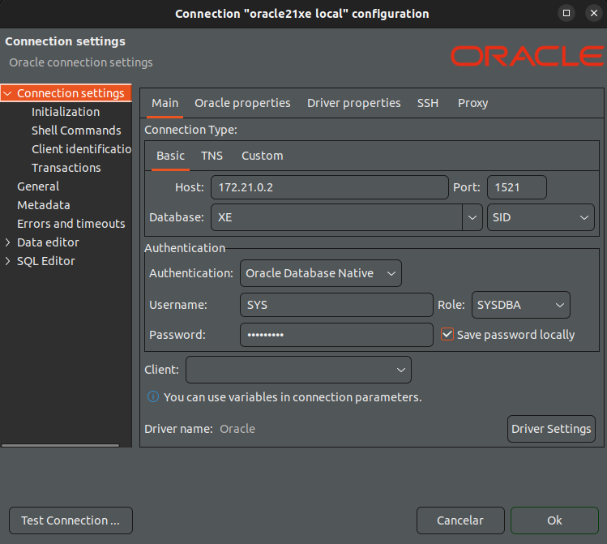

# Docker Oracle Database 21.3.0 XE

## Criar imagem Docker da base de dados Oracle versão 21.3.0 Express Edition

O nosso primeiro passo será clonar o projeto docker-images. Para isso, execute o seguinte comando no seu terminal:
```
git clone git@github.com:oracle/docker-images.git
```

Extraia os arquivos no seu computador e execute o seguinte comando no seu terminal:
```
cd docker-images/OracleDatabase/SingleInstance/dockerfiles
sudo ./buildContainerImage.sh -v 21.3.0 -x
```

Crie o serviço
```
docker-compose up -d
```

## Dados para conexão    
Host = "rode o comando a seguir para saber o IP"
```
docker exec -it oracle21xe hostname -i
```
Port = 1521
Database = XE <SID>
Username = SYS
Role = SYSDBA
Password = teste_123




