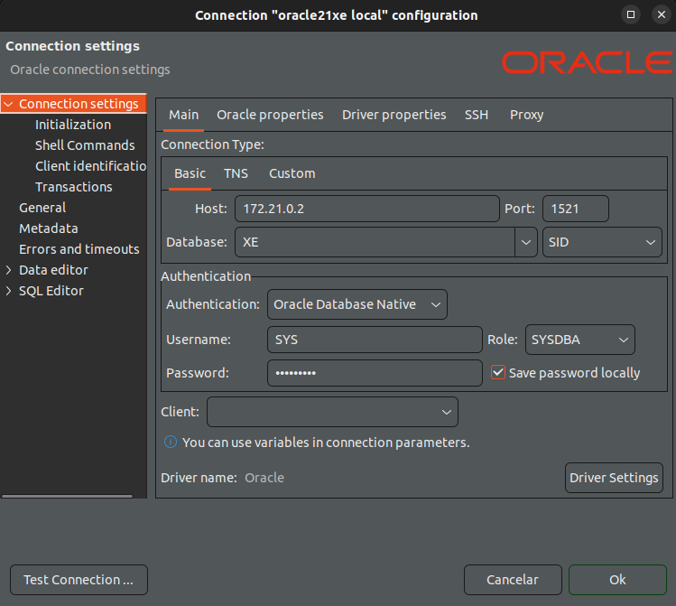

# Docker Oracle Database 21.3.0 XE

## Status

`0.1.0` — funcional para uso local (constrói a imagem Oracle XE 21.3.0 e sobe via Compose).
Versionado por [SemVer](https://semver.org/lang/pt-BR/) (`0.y.z`).

## Licença

Sem licença própria. A imagem **Oracle Database XE** segue a **licença da Oracle** (Oracle Free
Use Terms / OTN); este repositório contém apenas a *glue* de Docker para construí-la e subi-la.

## Criar imagem Docker da base de dados Oracle versão 21.3.0 Express Edition

O nosso primeiro passo será clonar o projeto docker-images. Para isso, execute o seguinte comando no seu terminal:
```
git clone git@github.com:oracle/docker-images.git
```

Extraia os arquivos no seu computador e execute o seguinte comando no seu terminal:
```
cd docker-images/OracleDatabase/SingleInstance/dockerfiles
sudo ./buildContainerImage.sh -v 21.3.0 -x
cd ../../../..
rm -rf docker-images
```

Crie o serviço
```
docker-compose up -d
```

## Dados para conexão    
Host = "rode o comando a seguir para saber o IP"
```
docker exec -it oracle21xe hostname -i
```
<p>Port = 1521<br>
Database = XE "SID"<br>
Username = SYS<br>
Role = SYSDBA<br>
Password = teste_123</p>




